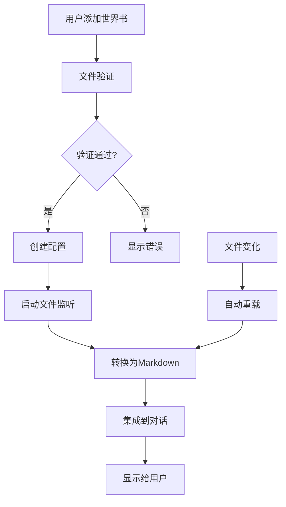

# SillyTavern 世界书系统集成设计

## 概述

本文档描述了SillyTavern世界书系统与ANH Chat的集成设计方案。该系统支持加载、转换和管理SillyTavern格式的世界书文件，并将其转换为Markdown格式，集成到对话系统中。

## 系统架构

### 模块结构

```
packages/types/src/
├── silly-tavern-worldbook.ts          # 类型定义
└── silly-tavern-worldbook-converter.ts # 转换工具

src/services/silly-tavern/
└── sillyTavernWorldBookService.ts     # 世界书服务

webview-ui/src/components/settings/
└── SillyTavernWorldBookSettings.tsx   # 配置界面
```

### 核心组件

#### 1. 类型定义 (`silly-tavern-worldbook.ts`)

**主要类型**：
- `WorldBook` - 世界书数据的顶层类型（支持多种格式）
- `WorldEntry` - 单个世界书词条
- `ToMarkdownOptions` - 转换选项
- `WorldBookConfig` - 配置信息
- `WorldBookInfo` - 世界书文件信息
- `WorldBookConversionResult` - 转换结果

**支持的格式**：
- `WorldBookDictShape` - `{ entries: Record<string, WorldEntry> }`
- `WorldBookArrayShape` - `{ entries: WorldEntry[] }`
- `LegacyWorldBook` - 直接的数组或字典格式

#### 2. 转换工具 (`silly-tavern-worldbook-converter.ts`)

**核心类**：`WorldBookConverter`

**主要功能**：
- 解析多种SillyTavern世界书格式
- 转换为Markdown格式
- 支持内容过滤和格式化
- 提供文件扫描和验证功能

**转换特性**：
- 智能标题生成
- 元数据表格/YAML前置
- 关键词提取
- 内容过滤和清理
- 多种排序策略

#### 3. 世界书服务 (`sillyTavernWorldBookService.ts`)

**核心类**：`WorldBookService`

**主要功能**：
- 世界书文件管理
- 自动重载监听
- 配置管理
- 与现有系统集成

**服务特性**：
- 文件监听和自动重载
- 批量转换和缓存
- 错误处理和恢复
- 性能优化

#### 4. 配置界面 (`SillyTavernWorldBookSettings.tsx`)

**界面功能**：
- 世界书列表展示
- 配置管理
- 文件浏览和验证
- 高级选项设置

## 数据流设计



## 配置系统

### 世界书配置

```typescript
interface WorldBookConfig {
  filePath: string;           // 文件路径
  enabled: boolean;           // 是否启用
  autoReload?: boolean;       // 自动重载
  reloadInterval?: number;    // 重载间隔
  markdownOptions?: {         // 转换选项
    headingLevel?: 1 | 2 | 3 | 4 | 5 | 6;
    titleStrategy?: 'auto' | 'comment' | 'key' | 'uid';
    includeDisabled?: boolean;
    sortBy?: 'order' | 'displayIndex' | 'uid' | 'title' | 'none';
    includeFrontMatter?: boolean;
    frontMatterStyle?: 'table' | 'yaml';
    includeKeys?: boolean;
    contentFilter?: {
      maxLength?: number;
      stripHtml?: boolean;
      normalizeWhitespace?: boolean;
    };
  };
}
```

### 默认配置

```typescript
const defaultConfig: WorldBookConfig = {
  filePath: '',
  enabled: true,
  autoReload: true,
  reloadInterval: 5000,
  markdownOptions: {
    headingLevel: 2,
    titleStrategy: 'auto',
    includeDisabled: false,
    sortBy: 'order',
    includeFrontMatter: true,
    frontMatterStyle: 'table',
    includeKeys: true,
    contentFilter: {
      maxLength: 0,
      stripHtml: true,
      normalizeWhitespace: true
    }
  }
};
```

## 转换算法

### 1. 数据标准化

```typescript
function normalizeToEntries(input: unknown): WorldEntry[] {
  // 支持多种输入格式：
  // - JSON字符串
  // - 对象格式 { entries: {...} }
  // - 数组格式 { entries: [...] }
  // - 直接的数组或字典
}
```

### 2. 数据清洗

```typescript
function sanitizeEntry(raw: any): WorldEntry {
  // 字段类型清洗
  // 必要字段验证
  // 警告信息收集
}
```

### 3. 排序算法

```typescript
function sortEntries(entries: WorldEntry[], primary: string, secondary: string): WorldEntry[] {
  // 支持多种排序策略：
  // - order (按排序字段)
  // - displayIndex (按显示索引)
  // - uid (按ID)
  // - title (按标题)
  // - none (不排序)
}
```

### 4. Markdown生成

```typescript
function convertToMarkdown(entries: WorldEntry[], options: ToMarkdownOptions): string {
  // 生成标题
  // 添加元数据
  // 处理关键词
  // 格式化内容
  // 应用过滤器
}
```

## 性能优化

### 1. 缓存机制

- **转换结果缓存**：避免重复转换相同文件
- **文件信息缓存**：缓存文件扫描结果
- **配置缓存**：缓存转换配置

### 2. 文件监听优化

- **防抖处理**：避免频繁重载
- **增量更新**：只重新加载变化的文件
- **错误恢复**：文件错误时的恢复机制

### 3. 内存管理

- **延迟加载**：按需加载世界书内容
- **内存限制**：限制同时加载的文件数量
- **垃圾回收**：及时清理不需要的资源

## 错误处理

### 1. 文件错误

- **文件不存在**：提示用户重新选择
- **格式错误**：显示详细的错误信息
- **权限错误**：提示权限问题

### 2. 转换错误

- **数据验证失败**：跳过无效词条
- **内容过滤错误**：记录警告信息
- **内存不足**：分批处理大文件

### 3. 运行时错误

- **服务异常**：自动重启服务
- **配置错误**：使用默认配置
- **网络错误**：离线模式运行

## 扩展点

### 1. 转换器扩展

```typescript
interface WorldBookConverterExtension {
  name: string;
  version: string;
  convert: (entries: WorldEntry[], options: ToMarkdownOptions) => string;
  validate: (data: unknown) => boolean;
}
```

### 2. 过滤器扩展

```typescript
interface ContentFilter {
  name: string;
  filter: (content: string, options: any) => string;
}
```

### 3. 格式化器扩展

```typescript
interface Formatter {
  name: string;
  format: (entry: WorldEntry, options: ToMarkdownOptions) => string;
}
```

## 与现有系统集成

### 1. 与触发词系统集成

```typescript
// 世界书词条可以作为触发词的来源
interface WorldBookTriggerConfig {
  worldBookId: string;
  entryIds: string[];
  triggerActions: TriggerAction[];
}
```

### 2. 与角色系统集成

```typescript
// 角色可以关联特定的世界书
interface RoleWorldBookConfig {
  roleId: string;
  worldBookIds: string[];
  injectionStrategy: 'auto' | 'manual' | 'conditional';
}
```

### 3. 与对话系统集成

```typescript
// 在对话生成时注入世界书内容
interface DialogueIntegration {
  injectWorldBooks: boolean;
  injectionPoint: 'system' | 'context' | 'both';
  maxTokens: number;
}
```

## 使用示例

### 1. 基本使用

```typescript
import { WorldBookConverter } from '@roo-code/types';

const converter = new WorldBookConverter();
const result = await converter.loadFromFile('path/to/worldbook.json', {
  headingLevel: 2,
  includeFrontMatter: true,
  sortBy: 'order'
});

console.log(result.markdown);
```

### 2. 服务集成

```typescript
import { WorldBookService } from '../services/silly-tavern/sillyTavernWorldBookService';

const service = new WorldBookService(outputChannel);
await service.initialize();

// 添加世界书
await service.addWorldBookConfig({
  filePath: 'path/to/worldbook.json',
  enabled: true,
  autoReload: true
});

// 获取活跃世界书的Markdown内容
const markdown = await service.getActiveWorldBooksMarkdown();
```

### 3. 配置管理

```typescript
// 在设置组件中
const handleAddWorldBook = async () => {
  const filePath = await browseWorldBookFile();
  if (filePath) {
    const validation = await validateWorldBookFile(filePath);
    if (validation.valid) {
      await addWorldBookConfig({
        filePath,
        enabled: true,
        autoReload: true
      });
    }
  }
};
```

## 测试策略

### 1. 单元测试

- **类型验证测试**：验证各种数据格式的解析
- **转换算法测试**：验证Markdown生成的正确性
- **排序功能测试**：验证各种排序策略
- **过滤器测试**：验证内容过滤功能

### 2. 集成测试

- **文件加载测试**：验证文件监听和重载
- **配置管理测试**：验证配置的保存和加载
- **错误处理测试**：验证各种错误情况的处理

### 3. 性能测试

- **大文件处理测试**：验证大文件的处理性能
- **内存使用测试**：验证内存使用的合理性
- **并发处理测试**：验证多文件并发处理

## 未来规划

### 阶段一：基础功能（当前实现）

- [x] 类型定义
- [x] 转换工具
- [x] 基础服务
- [x] 配置界面

### 阶段二：高级功能

- [ ] 批量处理
- [ ] 高级过滤
- [ ] 自定义格式化
- [ ] 性能优化

### 阶段三：智能功能

- [ ] 语义搜索
- [ ] 自动分类
- [ ] 智能推荐
- [ ] 学习优化

## 总结

SillyTavern世界书系统集成为Roo Code Chat提供了强大的知识管理能力，通过标准化的转换工具和完善的服务架构，实现了从SillyTavern格式到Markdown的无缝转换。系统具有良好的扩展性和可维护性，为后续的功能扩展奠定了基础。

---

*文档版本：1.0*
*创建日期：2025-10-11*
*作者：Roo Code Team*