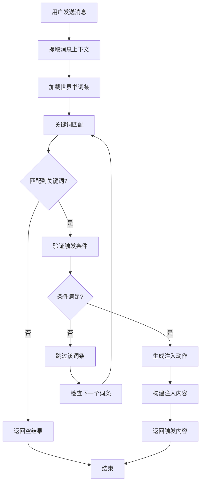

# SillyTavern 世界书触发词系统集成

## 概述

本文档描述了基于SillyTavern世界书的动态触发词系统的设计和实现。该系统能够根据世界书中的关键词和常驻设置，智能地向对话中注入相关知识内容，实现真正的动态知识管理。

## 系统特性

### 🎯 核心功能

1. **关键词触发**：基于世界书词条的主关键词和同义词进行智能匹配
2. **常驻注入**：标记为常驻的词条始终注入到对话上下文中
3. **动态匹配**：支持精确匹配、包含匹配、模糊匹配和语义匹配
4. **智能过滤**：基于选择性条件和上下文要求进行智能过滤
5. **性能优化**：缓存机制、防重复注入、批量处理

### 🔧 匹配策略

- **精确匹配** (`exact`)：完全匹配关键词
- **包含匹配** (`contains`)：文本包含关键词
- **模糊匹配** (`fuzzy`)：基于编辑距离的模糊匹配
- **语义匹配** (`semantic`)：基于语义理解的智能匹配

### 📊 注入机制

- **常驻内容**：标记为 `constant: true` 的词条始终注入
- **触发内容**：根据关键词匹配动态注入
- **冷却机制**：防止重复注入的智能冷却
- **优先级排序**：按优先级和权重排序注入

## 系统架构

### 模块结构

```
packages/types/src/
├── silly-tavern-worldbook.ts              # 基础类型定义
├── silly-tavern-worldbook-converter.ts    # 世界书转换器
├── silly-tavern-worldbook-trigger.ts      # 触发词类型定义
└── silly-tavern-worldbook-trigger-engine.ts # 触发词引擎

src/services/silly-tavern/
├── sillyTavernWorldBookService.ts         # 世界书服务
└── sillyTavernWorldBookTriggerService.ts  # 触发词服务

webview-ui/src/components/settings/
└── SillyTavernWorldBookSettings.tsx       # 配置界面
```

### 核心组件

#### 1. 触发词引擎 (`WorldBookTriggerEngine`)

**核心功能**：
- 词条加载和管理
- 关键词匹配算法
- 触发条件验证
- 注入动作生成

**匹配算法**：
```typescript
// 精确匹配
private exactMatch(content: string, keyword: string): boolean

// 包含匹配
private containsMatch(content: string, keyword: string): boolean

// 模糊匹配（基于Levenshtein距离）
private fuzzyMatch(content: string, keyword: string): MatchResult

// 语义匹配（可集成外部API）
private async semanticMatch(content: string, keyword: string): Promise<SemanticResult>
```

#### 2. 触发词服务 (`SillyTavernWorldBookTriggerService`)

**核心功能**：
- 服务生命周期管理
- 配置管理
- 与现有系统集成
- 实时触发处理

**集成接口**：
```typescript
// 处理消息
async processMessage(message: ChatMessage, history: ChatMessage[]): Promise<TriggeredContent>

// 获取常驻内容
async getConstantContent(): Promise<string>

// 管理世界书文件
async addWorldBookFile(filePath: string): Promise<boolean>
async removeWorldBookFile(filePath: string): Promise<boolean>
```

## 配置系统

### 触发词配置

```typescript
interface WorldBookTriggerConfig {
  enabled: boolean;                    // 是否启用
  checkHistoryLength: number;          // 检查历史消息数量
  matchStrategy: 'exact' | 'contains' | 'fuzzy' | 'semantic';
  caseSensitive: boolean;              // 大小写敏感
  enableSynonyms: boolean;             // 启用同义词匹配
  fuzzyThreshold: number;              // 模糊匹配阈值
  semanticThreshold: number;           // 语义匹配阈值
  maxInjectEntries: number;            // 最大注入词条数
  injectionStrategy: 'replace' | 'append' | 'prepend' | 'insert';
  injectionCooldown: number;           // 注入冷却时间
  debugMode: boolean;                  // 调试模式
}
```

### 世界书词条配置

在SillyTavern世界书JSON中，以下字段会影响触发行为：

```json
{
  "uid": 123,
  "key": ["魔法", "魔法术"],           // 主关键词
  "keysecondary": ["法术", "咒文"],      // 同义词
  "comment": "魔法系统说明",            // 词条标题
  "content": "详细的魔法知识...",       // 词条内容
  "constant": true,                    // 是否常驻
  "order": 10,                         // 优先级
  "selective": true,                   // 选择性触发
  "selectiveLogic": 1,                 // 选择逻辑
  "depth": 5,                          // 上下文深度要求
  "group": "魔法知识",                 // 分组
  "groupWeight": 1.5                   // 分组权重
}
```

## 使用示例

### 1. 基本集成

```typescript
import { SillyTavernWorldBookTriggerService } from '../services/silly-tavern/sillyTavernWorldBookTriggerService';

// 创建服务
const triggerService = new SillyTavernWorldBookTriggerService(
  {
    enabled: true,
    triggerConfig: {
      enabled: true,
      checkHistoryLength: 5,
      matchStrategy: 'contains',
      caseSensitive: false,
      enableSynonyms: true,
      fuzzyThreshold: 0.7,
      semanticThreshold: 0.8,
      maxInjectEntries: 3,
      injectionCooldown: 30000,
      debugMode: false
    },
    realTimeConfig: {
      enabled: true,
      debounceDelay: 1000,
      minTriggerInterval: 2000,
      allowConcurrent: false
    },
    worldBookFiles: [
      'path/to/worldbook1.json',
      'path/to/worldbook2.json'
    ],
    autoReloadWorldBooks: true,
    reloadInterval: 30
  },
  outputChannel
);

// 初始化服务
await triggerService.initialize();

// 处理消息
const message = { content: "我想学习魔法", role: 'user' };
const result = await triggerService.processMessage(message, conversationHistory);

if (result) {
  console.log("注入内容:", result.fullContent);
  console.log("常驻内容:", result.constantContent);
  console.log("触发内容:", result.triggeredContent);
}
```

### 2. 在提示词生成中集成

```typescript
// 在 generatePrompt 函数中集成
async function generatePrompt(
  context: vscode.ExtensionContext,
  cwd: string,
  // ... 其他参数
  rolePromptData?: RolePromptData,
  triggerService?: SillyTavernWorldBookTriggerService,
  lastUserMessage?: string,
  conversationHistory?: ChatMessage[]
): Promise<string> {
  let prompt = await generateBasePrompt(/* ... */);

  // 获取常驻内容
  if (triggerService) {
    const constantContent = await triggerService.getConstantContent();
    if (constantContent) {
      prompt += '\n\n' + constantContent;
    }

    // 处理最新消息的触发
    if (lastUserMessage) {
      const userMessage = { content: lastUserMessage, role: 'user' as const };
      const triggeredContent = await triggerService.processMessage(userMessage, conversationHistory || []);

      if (triggeredContent?.triggeredContent) {
        prompt += '\n\n' + triggeredContent.triggeredContent;
      }
    }
  }

  return prompt;
}
```

### 3. 世界书文件示例

```json
{
  "entries": {
    "magic_system": {
      "uid": 1,
      "key": ["魔法", "魔法术", "法术"],
      "keysecondary": ["咒文", "魔法技能"],
      "comment": "魔法系统",
      "content": "在这个世界中，魔法是一种神秘的力量...\n\n**基本原理：**\n- 魔法源于精神力量\n- 需要咒文和手势配合\n- 不同元素有不同的属性",
      "constant": true,
      "order": 10,
      "depth": 3
    },
    "combat_rules": {
      "uid": 2,
      "key": ["战斗", "攻击", "防御"],
      "keysecondary": ["格斗", "作战"],
      "comment": "战斗规则",
      "content": "战斗系统采用回合制...\n\n**行动点数：**\n- 每回合有10点行动点\n- 不同行动消耗不同点数",
      "constant": false,
      "order": 5,
      "depth": 2,
      "selective": true,
      "selectiveLogic": 1
    }
  }
}
```

## 工作流程

### 触发流程图



### 详细处理步骤

1. **消息预处理**
   - 提取当前消息和历史上下文
   - 清理和标准化文本内容
   - 准备匹配环境

2. **词条加载**
   - 从配置的世界书文件加载词条
   - 解析关键词和同义词
   - 构建触发条目列表

3. **关键词匹配**
   - 根据配置的匹配策略进行匹配
   - 计算匹配分数和位置
   - 收集所有匹配结果

4. **条件验证**
   - 检查冷却时间
   - 验证选择性条件
   - 检查上下文要求
   - 过滤无效匹配

5. **动作生成**
   - 为常驻词条生成注入动作
   - 为触发词条生成临时注入动作
   - 按优先级排序

6. **内容构建**
   - 格式化词条内容
   - 合并常驻和触发内容
   - 应用注入策略

## 性能优化

### 1. 缓存机制

```typescript
// 语义搜索缓存
private semanticCache = new Map<string, SemanticSearchResult[]>();

// 匹配结果缓存
private matchCache = new Map<string, TriggerMatch[]>();

// 词条内容缓存
private contentCache = new Map<string, string>();
```

### 2. 批量处理

```typescript
// 批量处理选项
interface BatchProcessingOptions {
  concurrency: number;      // 并发数
  batchSize: number;        // 批次大小
  timeout: number;          // 超时时间
  retryAttempts: number;    // 重试次数
}
```

### 3. 防重复机制

```typescript
// 注入历史记录
interface InjectionHistory {
  entryId: string;          // 词条ID
  timestamp: number;        // 注入时间
  triggerKeyword: string;   // 触发关键词
  injectionType: 'constant' | 'triggered';
  expireAt: number;         // 过期时间
}
```

## 高级功能

### 1. 语义匹配

```typescript
interface SmartMatchingOptions {
  enableSemantic: boolean;
  semanticModel?: {
    provider: 'openai' | 'local' | 'custom';
    model: string;
    apiKey?: string;
    endpoint?: string;
  };
  customSynonyms?: Record<string, string[]>;
  fuzzyConfig?: {
    algorithm: 'levenshtein' | 'jaro-winkler' | 'cosine';
    maxDistance: number;
    caseSensitive: boolean;
  };
}
```

### 2. 选择性触发

```typescript
interface SelectiveCondition {
  type: 'character' | 'user' | 'scenario' | 'tag' | 'custom';
  value: string | string[];
  operator: 'equals' | 'contains' | 'matches' | 'in' | 'not_in';
  required: boolean;
}
```

### 3. 上下文要求

```typescript
interface ContextRequirement {
  type: 'min_messages' | 'max_messages' | 'time_since_last' | 'user_role' | 'conversation_topic';
  value: number | string;
  operator: 'gte' | 'lte' | 'eq' | 'contains' | 'matches';
}
```

## 调试和监控

### 1. 调试模式

启用调试模式后，系统会输出详细的处理信息：

```typescript
interface TriggerDebugInfo {
  messagesChecked: number;      // 检查的消息数量
  candidatesCount: number;      // 候选词条数量
  matchedTriggers: TriggerMatch[]; // 匹配的触发词
  skippedEntries: Array<{        // 跳过的词条
    entryId: string;
    reason: string;
  }>;
  performance: {                 // 性能统计
    parseTime: number;
    matchTime: number;
    filterTime: number;
    injectionTime: number;
  };
}
```

### 2. 统计信息

```typescript
interface TriggerStats {
  totalTriggers: number;        // 总触发次数
  todayTriggers: number;        // 今日触发次数
  popularEntries: Array<{       // 热门词条
    entryId: string;
    title: string;
    triggerCount: number;
  }>;
  avgResponseTime: number;      // 平均响应时间
}
```

### 3. 实时监控

```typescript
// 获取实时状态
const state = triggerService.getTriggerState();

// 监控触发词命中率
const hitRate = state.triggerStats.totalTriggers / state.loadedEntries.length;

// 监控响应时间
const avgTime = state.triggerStats.avgResponseTime;
```

## 故障排除

### 常见问题

1. **触发词不匹配**
   - 检查关键词拼写
   - 确认匹配策略设置
   - 验证大小写敏感设置

2. **常驻内容不显示**
   - 确认词条标记为 `constant: true`
   - 检查服务是否正确初始化
   - 验证世界书文件格式

3. **性能问题**
   - 减少检查的历史消息数量
   - 限制世界书文件大小
   - 启用缓存机制

4. **重复注入**
   - 调整冷却时间设置
   - 检查注入历史清理
   - 验证防重复逻辑

### 日志分析

启用调试模式后，可以在输出窗口查看详细的处理日志：

```
[WorldBookTrigger] 处理消息完成，注入 2 个词条
[WorldBookTrigger] 触发内容预览: ## 魔法系统...
[WorldBookTrigger] 性能统计: parseTime=15ms, matchTime=45ms, filterTime=8ms, injectionTime=12ms
```

## 未来规划

### 阶段一：基础功能 ✅
- [x] 关键词触发系统
- [x] 常驻内容注入
- [x] 基础匹配算法
- [x] 性能优化

### 阶段二：高级功能 🚧
- [ ] 语义搜索集成
- [ ] 自定义同义词词典
- [ ] 高级过滤条件
- [ ] 批量处理优化

### 阶段三：智能功能 📋
- [ ] 机器学习优化
- [ ] 自动关键词提取
- [ ] 智能推荐系统
- [ ] 多语言支持

## 总结

SillyTavern世界书触发词系统为ANH Chat提供了强大的动态知识注入能力。通过智能的关键词匹配和上下文感知，系统能够在合适的时机向对话中注入相关知识，大大提升了AI对话的知识丰富度和准确性。

系统的模块化设计和完善的配置选项使其能够适应各种使用场景，从简单的关键词触发到复杂的语义理解，都能得到很好的支持。

---

*文档版本：1.0*
*创建日期：2025-10-11*
*作者：Andrea Frederica*