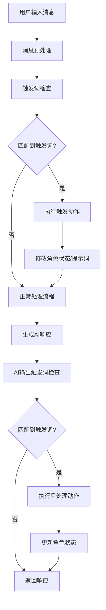

# 触发词检查功能设计方案

## 概述

触发词检查功能允许系统根据用户输入或AI输出的内容，自动检测特定关键词或模式，并执行相应的动作（如注入特定提示词、切换角色模式、修改角色性格等）。

## 功能目标

1. **智能响应**：根据对话内容动态调整角色行为
2. **场景切换**：自动识别用户意图并切换对话场景
3. **个性化体验**：为每个角色定制独特的触发词和行为
4. **性能优化**：高效的匹配算法，不影响对话响应速度

## 系统架构分析

### 当前系统架构

**主要组件**：
- `generatePrompt()` - 提示词生成核心函数 (`src/core/prompts/system.ts:909`)
- `applySillyTavernRoleOverride()` - 角色覆盖逻辑
- `ClineProvider.ts` - 任务和消息处理
- `webviewMessageHandler.ts` - 用户消息处理

**可用的上下文源**：
- `todoList` - 当前任务列表
- `memory` - 对话记忆
- `rolePromptData` - 角色信息
- 对话历史 - 存储在状态管理中

### 实现方案

## 方案一：提示词生成时检查（推荐）

### 实现位置
`src/core/prompts/system.ts` 中的 `generatePrompt()` 函数

### 优势
- 与现有提示词生成逻辑紧密集成
- 可以直接修改生成的提示词
- 支持基于角色配置的个性化触发

### 实现步骤

#### 1. 修改函数签名
```typescript
async function generatePrompt(
  context: vscode.ExtensionContext,
  cwd: string,
  // ... 现有参数
  conversationHistory?: ChatMessage[],
  lastUserMessage?: string,
  lastAiResponse?: string,
  triggerConfig?: TriggerConfig
): Promise<string>
```

#### 2. 触发词配置结构
```typescript
interface TriggerConfig {
  globalTriggers: GlobalTrigger[]
  roleSpecificTriggers: Record<string, RoleTrigger[]>
  settings: TriggerSettings
}

interface GlobalTrigger {
  id: string
  name: string
  patterns: string[] // 支持正则表达式
  matchType: 'exact' | 'contains' | 'regex'
  scope: 'user_input' | 'ai_output' | 'both'
  actions: TriggerAction[]
  enabled: boolean
  priority: number
}

interface RoleTrigger extends GlobalTrigger {
  roleId: string
  conditions?: TriggerCondition[] // 额外的触发条件
}

interface TriggerAction {
  type: 'inject_prompt' | 'switch_mode' | 'set_variable' | 'modify_personality' | 'append_instructions'
  payload: any
  temporary?: boolean
  duration?: number // 临时生效的持续时间（消息数量）
}

interface TriggerSettings {
  enabled: boolean
  checkHistoryLength: number // 检查最近N条消息
  caseSensitive: boolean
  preventRecursion: boolean
  debugMode: boolean
}
```

#### 3. 触发词检查逻辑
```typescript
class TriggerWordChecker {
  private compiledPatterns = new Map<string, RegExp>()

  checkTriggers(
    messages: ChatMessage[],
    triggers: TriggerConfig[],
    scope: 'user' | 'ai' | 'both'
  ): TriggerAction[] {
    const actions: TriggerAction[] = []

    // 检查最近的消息
    const recentMessages = messages.slice(-triggers.settings.checkHistoryLength)

    for (const trigger of triggers) {
      if (!trigger.enabled) continue

      for (const message of recentMessages) {
        if (this.matchesTrigger(message.content, trigger, scope)) {
          actions.push(...trigger.actions)
          break // 避免重复触发
        }
      }
    }

    return this.prioritizeActions(actions)
  }

  private matchesTrigger(content: string, trigger: TriggerConfig, scope: string): boolean {
    // 实现匹配逻辑
  }

  private prioritizeActions(actions: TriggerAction[]): TriggerAction[] {
    // 按优先级排序动作
  }
}
```

#### 4. 提示词注入逻辑
```typescript
function applyTriggerActions(
  basePrompt: string,
  actions: TriggerAction[],
  context: PromptContext
): string {
  let modifiedPrompt = basePrompt

  for (const action of actions) {
    switch (action.type) {
      case 'inject_prompt':
        modifiedPrompt = `${action.payload}\n\n${modifiedPrompt}`
        break
      case 'append_instructions':
        modifiedPrompt = `${modifiedPrompt}\n\n### Additional Instructions\n${action.payload}`
        break
      case 'modify_personality':
        // 临时修改角色性格描述
        break
      case 'set_variable':
        // 设置模板变量
        break
    }
  }

  return modifiedPrompt
}
```

## 方案二：消息处理阶段检查

### 实现位置
`src/core/webview/ClineProvider.ts` 或 `src/core/webview/webviewMessageHandler.ts`

### 优势
- 可以在消息进入系统前就进行拦截
- 不需要修改核心提示词生成逻辑
- 更灵活的处理流程

### 实现思路
1. 消息到达时先进行触发词检查
2. 如果匹配触发词，修改角色状态或添加特殊指令
3. 然后继续正常的消息处理流程

### 实现示例
```typescript
// 在 ClineProvider.ts 中
async function handleMessageWithTriggers(message: string): Promise<void> {
  // 检查触发词
  const triggerActions = await this.checkTriggers(message, this.currentRole)

  // 应用触发动作
  if (triggerActions.length > 0) {
    await this.applyTriggerActions(triggerActions)
  }

  // 继续正常的消息处理
  await this.processMessage(message)
}
```

## 方案三：基于角色的自动触发

### 实现位置
`src/core/prompts/system.ts` 中的 `applySillyTavernRoleOverride()` 函数

### 特点
- 每个角色可以有自己的触发词配置
- 基于角色的性格和行为模式定制触发词
- 支持角色状态切换

### 实现示例
```typescript
function applySillyTavernRoleOverride(
  selection: { roleDefinition: string; baseInstructions: string; description: string },
  rolePromptData: RolePromptData,
  options: RoleOverrideOptions,
  triggerActions?: TriggerAction[]
): { roleDefinition: string; baseInstructions: string; description: string } {

  // 应用现有的角色覆盖逻辑
  let result = { ...selection }

  // 应用触发词动作
  if (triggerActions && triggerActions.length > 0) {
    result.roleDefinition = applyTriggerActions(result.roleDefinition, triggerActions, {
      role: rolePromptData.role,
      context: options
    })
  }

  return result
}
```

## 数据流设计

### 触发词检查流程



### 配置数据结构

```typescript
// 全局触发词配置
interface GlobalTriggerConfig {
  version: string
  enabled: boolean
  triggers: GlobalTrigger[]
  settings: TriggerSettings
}

// 角色特定触发词配置
interface RoleTriggerConfig {
  roleId: string
  triggers: RoleTrigger[]
  inheritGlobal: boolean
}

// 完整的触发词配置
interface CompleteTriggerConfig {
  global: GlobalTriggerConfig
  roles: Record<string, RoleTriggerConfig>
}
```

## 实现优先级

### 阶段一：基础触发词系统（高优先级）
1. **核心功能**：
   - 在 `generatePrompt()` 函数中添加历史消息参数
   - 实现简单的触发词匹配逻辑（精确匹配和包含匹配）
   - 支持基础的提示词注入功能

2. **配置管理**：
   - 在设置中添加触发词配置界面
   - 支持全局触发词和角色特定触发词
   - 基础的启用/禁用控制

3. **性能优化**：
   - 限制检查的消息历史长度
   - 实现简单的匹配算法优化

### 阶段二：高级触发功能（中优先级）
1. **高级匹配**：
   - 支持正则表达式匹配
   - 实现条件逻辑（AND/OR）
   - 支持多级触发和触发链

2. **动态行为**：
   - 临时角色状态修改
   - 基于触发词的角色模式切换
   - 模板变量动态设置

3. **用户体验**：
   - 触发词配置的完整UI界面
   - 触发历史和统计信息
   - 调试模式和日志查看

### 阶段三：智能触发系统（低优先级）
1. **语义理解**：
   - 基于语义理解的触发（不只是关键词）
   - 上下文感知的触发逻辑
   - 意图识别和分类

2. **学习优化**：
   - 学习用户习惯，自动优化触发规则
   - 基于使用统计的触发词建议
   - A/B测试支持

3. **高级功能**：
   - 触发词的自动生成
   - 基于情感分析的触发
   - 多语言支持

## 技术挑战与解决方案

### 1. 性能影响
**挑战**：每条消息都要进行触发词检查可能影响响应速度

**解决方案**：
- 使用编译后的正则表达式缓存
- 限制检查范围和消息历史长度
- 异步处理非关键触发动作
- 实现智能的触发频率控制

### 2. 递归触发
**挑战**：避免触发词检查导致的无限循环

**解决方案**：
- 实现触发状态机，防止重复触发
- 设置触发冷却时间
- 限制单个触发词的最大触发次数
- 实现触发依赖关系检查

### 3. 上下文管理
**挑战**：临时修改需要正确的恢复机制

**解决方案**：
- 实现状态栈，支持状态回滚
- 使用引用计数管理临时状态
- 实现状态超时自动恢复
- 提供手动状态重置功能

### 4. 用户体验
**挑战**：触发词的可见性和可控性

**解决方案**：
- 提供触发词配置的直观界面
- 实时显示触发状态和效果
- 支持触发词的测试和调试
- 提供详细的触发日志和统计

## 配置示例

### 基础触发词配置
```json
{
  "global": {
    "version": "1.0",
    "enabled": true,
    "triggers": [
      {
        "id": "debug_mode",
        "name": "调试模式",
        "patterns": ["进入调试模式", "debug mode"],
        "matchType": "contains",
        "scope": "user_input",
        "actions": [
          {
            "type": "inject_prompt",
            "payload": "你现在处于调试模式，请详细解释你的思考过程。",
            "temporary": true,
            "duration": 5
          }
        ],
        "enabled": true,
        "priority": 1
      }
    ],
    "settings": {
      "enabled": true,
      "checkHistoryLength": 3,
      "caseSensitive": false,
      "preventRecursion": true,
      "debugMode": false
    }
  },
  "roles": {
    "character-123": {
      "roleId": "character-123",
      "triggers": [
        {
          "id": "combat_mode",
          "name": "战斗模式",
          "patterns": ["战斗", "攻击", "combat"],
          "matchType": "contains",
          "scope": "both",
          "actions": [
            {
              "type": "modify_personality",
              "payload": {
                "personality": "警惕、专注、准备战斗",
                "tone": "严肃"
              },
              "temporary": true,
              "duration": 10
            }
          ],
          "enabled": true,
          "priority": 2
        }
      ],
      "inheritGlobal": true
    }
  }
}
```

### 高级触发词配置
```json
{
  "triggers": [
    {
      "id": "complex_scenario",
      "name": "复杂场景切换",
      "patterns": ["开始.*游戏", "我们来玩.*游戏"],
      "matchType": "regex",
      "scope": "user_input",
      "conditions": [
        {
          "type": "context_check",
          "field": "current_mode",
          "operator": "equals",
          "value": "normal"
        }
      ],
      "actions": [
        {
          "type": "switch_mode",
          "payload": "game_mode"
        },
        {
          "type": "inject_prompt",
          "payload": "你现在是游戏主持人，请按照游戏规则引导用户。",
          "temporary": true,
          "duration": 20
        },
        {
          "type": "set_variable",
          "payload": {
            "game_context": "active",
            "game_type": "auto_detected"
          }
        }
      ],
      "enabled": true,
      "priority": 3
    }
  ]
}
```

## 测试策略

### 单元测试
1. **触发词匹配测试**：
   - 测试各种匹配类型（精确、包含、正则）
   - 测试大小写敏感性和国际化支持
   - 测试复杂正则表达式的正确性

2. **动作执行测试**：
   - 测试各种触发动作的正确执行
   - 测试临时状态的管理和恢复
   - 测试动作优先级和冲突解决

3. **性能测试**：
   - 测试大量触发词情况下的性能表现
   - 测试长消息历史对性能的影响
   - 测试并发触发的处理能力

### 集成测试
1. **端到端测试**：
   - 测试完整的触发流程
   - 测试与现有系统的集成
   - 测试错误处理和恢复机制

2. **用户场景测试**：
   - 测试典型的用户使用场景
   - 测试复杂的多角色对话场景
   - 测试边界条件和异常情况

### 用户测试
1. **可用性测试**：
   - 测试配置界面的易用性
   - 测试触发词配置的学习曲线
   - 测试调试功能的实用性

2. **效果测试**：
   - 测试触发词的准确性和召回率
   - 测试用户体验的改善程度
   - 测试性能影响是否在可接受范围内

## 总结

触发词检查功能是一个强大的增强特性，可以显著提升对话系统的智能化程度和用户体验。通过分阶段实现，可以确保功能的稳定性和可维护性。

推荐使用**方案一**（提示词生成时检查）作为主要实现方案，因为它与现有系统架构最为匹配，并且可以充分利用现有的提示词生成逻辑。

通过合理的设计和实现，这个功能将为系统带来以下价值：
- 提供更智能的对话体验
- 支持复杂的角色扮演场景
- 增强系统的个性化能力
- 为高级用户提供更多控制选项

---

*文档版本：1.0*
*创建日期：2025-10-11*
*作者：Andrea Frederica*